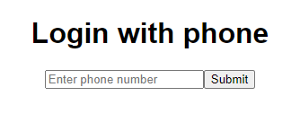
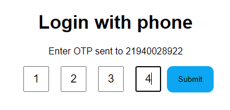

# OTP Frontend Component

This project is an OTP (One Time Password) component developed in React and TypeScript. It allows the user to enter an OTP sent to their phone number, with support for validation and event handling.

## Overview

This component was created to practice using React and TypeScript, as well as to implement some user interface (UI) ideas for OTP input and verification.

## Technologies Used

- React
- TypeScript
- CSS Modules

## Features

- Phone Number Validation: Checks if the entered phone number is valid before requesting the OTP.
- OTP Input: Allows the user to enter the OTP through multiple input fields.
- Automatic Focus: Automatically focuses on the next input field after a digit is entered.
- Keyboard Navigation: Supports navigation between input fields using arrow keys and Backspace.
- OTP Submission: Allows OTP submission to a verification function after complete entry.

## Component Descriptions

### PhoneOtpForm

This component is responsible for capturing the user's phone number and displaying the OTP input field after validating the number.

### OtpInput

This component is responsible for capturing the OTP entered by the user. It consists of multiple input fields that allow the user to type each digit of the OTP.

## Screenshots

